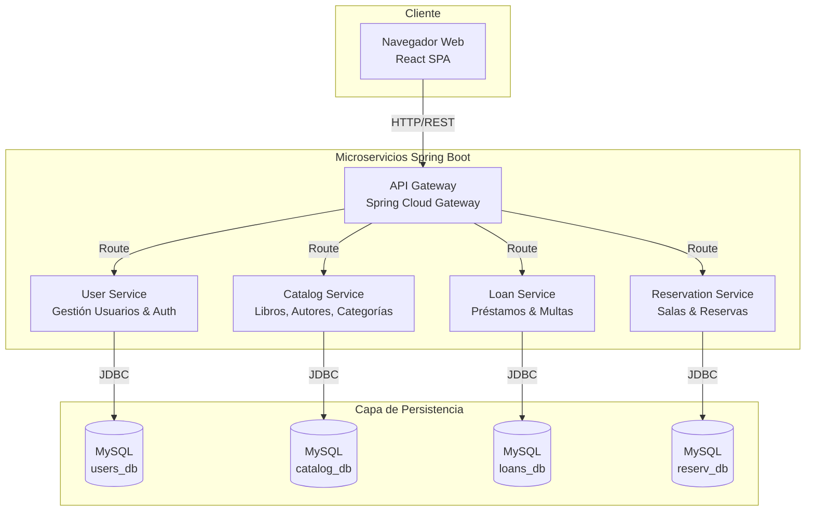
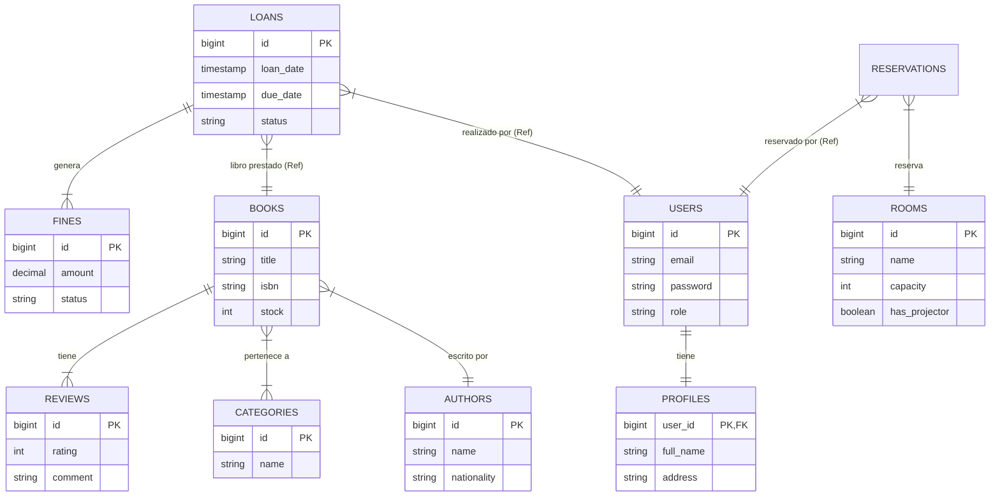
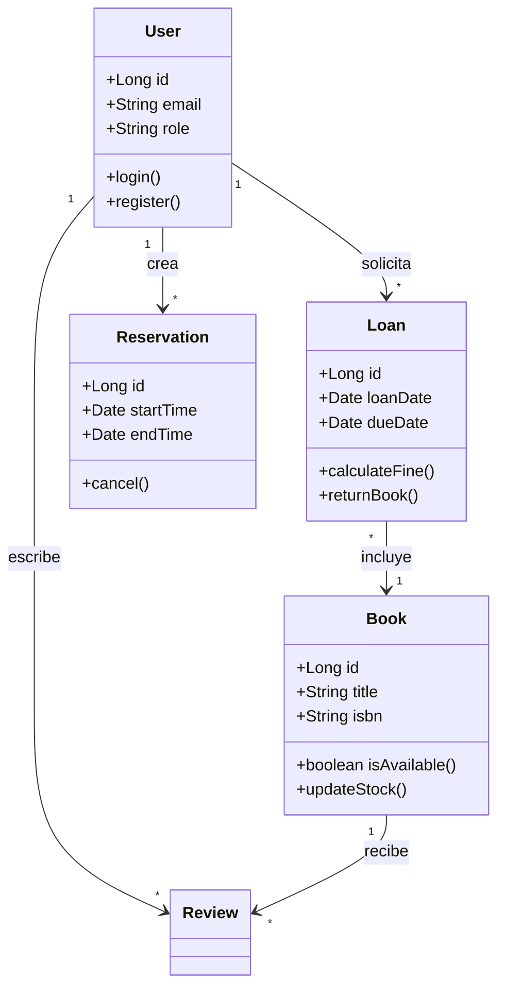
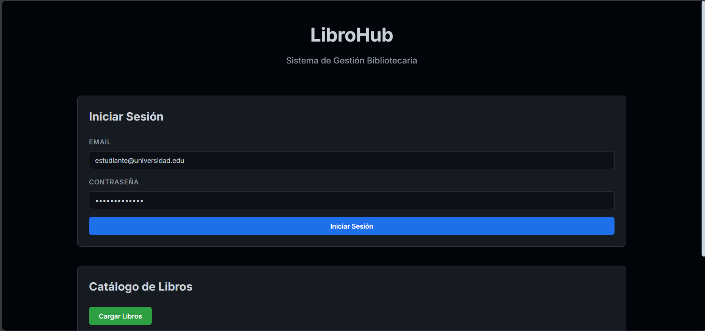

# 📚 LibroHub - Sistema de Gestión de Biblioteca Universitaria

## 🎯 Descripción del Proyecto
**LibroHub** es una aplicación web basada en microservicios diseñada para modernizar y automatizar los procesos de gestión en bibliotecas universitarias. El sistema permite gestionar préstamos de libros, reservas de salas de estudio, control de inventario y administración de usuarios con diferentes roles, todo contenedorizado con Docker y desarrollado con Spring Boot.

## 👥 Integrantes del Equipo
- **Jaider Bermúdez**
- **Jhojan Bueno** 
- **Juan Contreras**

## 🏗️ Arquitectura del Sistema

El sistema utiliza una arquitectura de microservicios orquestada mediante Docker Compose.

### Diagrama de Arquitectura (C4 Context)



## 🗂️ Modelo de Datos (Diagrama Entidad-Relación)

La base de datos se ha diseñado siguiendo un esquema distribuido (Database per Service) pero con relaciones lógicas claras.



## 🧩 Diagrama de Clases (Dominio)

Representación de las entidades principales del dominio y sus interacciones.



## 🚀 Objetivo de este README
Proveer una guía práctica y reproducible para crear el proyecto desde 0: scaffolding de microservicios, configuración mínima, Dockerfiles, docker-compose y checklist de tareas para que el equipo implemente el MVP siguiendo pasos claros.

## 1. Estructura del Proyecto
```
-Librohub/
├── microservices/
│   ├── api-gateway/           # API Gateway (Spring Cloud Gateway)
│   ├── user-service/          # Gestión de usuarios, perfiles y autenticación
│   ├── catalog-service/       # Catálogo avanzado (Autores, Categorías, Reviews)
│   ├── loan-service/          # Préstamos, devoluciones y multas automáticas
│   └── reservation-service/   # Reservas de salas de estudio
├── frontend/                  # Aplicación React
├── docker-compose.yml         # Orquestación de contenedores
├── database/
│   └── init-scripts/          # Scripts SQL iniciales (Esquema completo)
└── documentation/             # Documentación del proyecto
```

## 2. Comandos para generar scaffolding rápido

1) **Generar microservicios backend** con Spring Initializr (ejemplo para `catalog-service`):
```bash
curl "https://start.spring.io/starter.zip?type=maven-project&language=java&bootVersion=3.1.0&baseDir=catalog-service&groupId=edu.univalle.librohub&artifactId=catalog-service&name=catalog-service&packageName=edu.univalle.librohub.catalog&dependencies=web,data-jpa,mysql,security,actuator,lombok" -o catalog-service.zip
unzip catalog-service.zip -d microservices/
```

2) **Generar frontend** con Vite + React + TypeScript:
```bash
npm create vite@latest frontend -- --template react-ts
cd frontend
npm install
```

## 3. Docker y Despliegue

### Dockerfile Backend (Ejemplo Genérico)
```dockerfile
FROM eclipse-temurin:17-jdk-alpine
ARG JAR_FILE=target/*.jar
WORKDIR /app
COPY ${JAR_FILE} app.jar
EXPOSE 8080
ENTRYPOINT ["java","-jar","/app/app.jar"]
```

### Comandos de Ejecución
```bash
# Iniciar todos los servicios
docker-compose up --build

# Ver logs en tiempo real
docker-compose logs -f
```

## 📡 Endpoints Principales de la API

### Autenticación
- `POST /api/auth/login`: Iniciar sesión (JWT)
- `POST /api/auth/register`: Registro de usuarios
- `GET /api/auth/profile`: Perfil detallado del usuario

### Gestión de Catálogo
- `GET /api/catalog/books`: Listar libros con filtros (autor, categoría)
- `GET /api/catalog/books/{id}`: Detalle de libro + reseñas
- `POST /api/catalog/reviews`: Agregar reseña a un libro

### Préstamos y Multas
- `POST /api/loans/borrow`: Solicitar préstamo
- `POST /api/loans/return/{id}`: Devolver libro (calcula multas si aplica)
- `GET /api/loans/fines`: Ver multas pendientes

### Reservas
- `GET /api/reservations/rooms`: Listar salas disponibles
- `POST /api/reservations`: Reservar sala

## 🎓 Información Académica
**Universidad:** Universidad del Valle  
**Programa:** Tecnología en Desarrollo de Software  
**Materia:** Desarrollo de Software III  
**Docente:** Juan Pablo Pinillos Reina  
**Semestre:** 2025-2  

*Proyecto desarrollado con fines académicos demostrando habilidades en microservicios, Spring Boot, Docker y React.*

---

<div align="center">
  
**✨ Desarrollado por Jaider, Jhojan y Juan ✨**

[](https://spring.io/)
[](https://reactjs.org/)
[](https://www.docker.com/)
[](https://www.mysql.com/)

</div

## Pagina principal:


