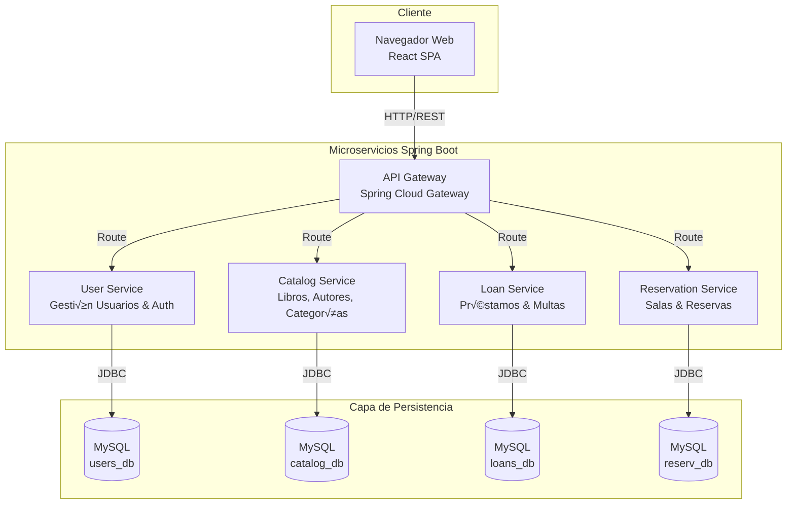
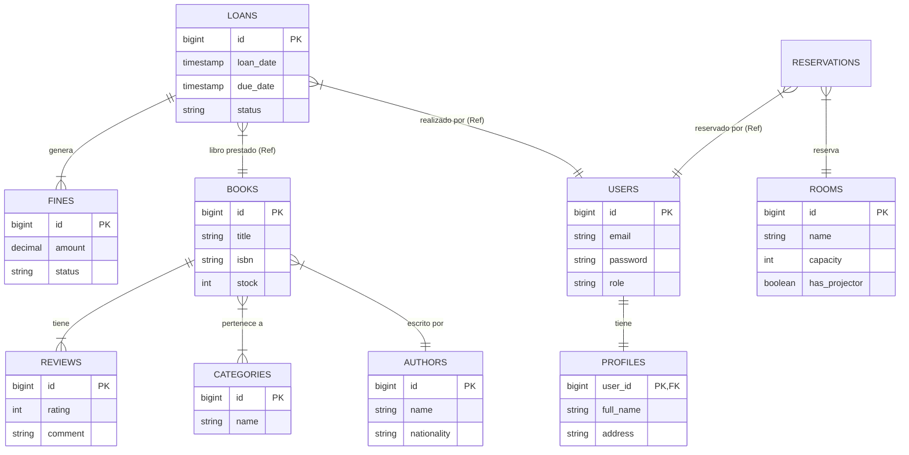
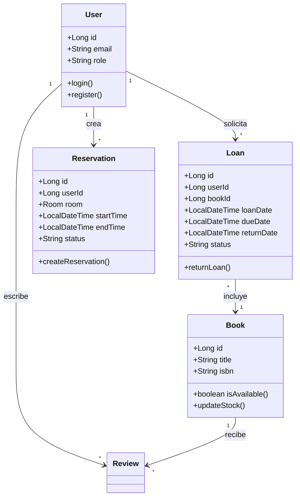

# 📚 LibroHub - Sistema de Gestión de Biblioteca Universitaria

## 🎯 Descripción del Proyecto
**LibroHub** es una aplicación web basada en microservicios diseñada para modernizar y automatizar los procesos de gestión en bibliotecas universitarias. El sistema permite gestionar préstamos de libros, reservas de salas de estudio, control de inventario y administración de usuarios con diferentes roles, todo contenedorizado con Docker y desarrollado con Spring Boot.

## üë• Integrantes del Equipo
- **Jaider Berm√∫dez**
- **Jhojan Bueno** 
- **Juan Contreras**

## 🏗️ Arquitectura del Sistema

El sistema utiliza una arquitectura de microservicios orquestada mediante Docker Compose.

### Diagrama de Arquitectura (C4 Context)


```mermaid
graph TB
    subgraph Client [Cliente]
        Browser[Navegador Web<br/>React SPA]
    end

    subgraph Backend [Microservicios Spring Boot]
        Gateway[API Gateway<br/>Spring Cloud Gateway]
        Auth[User Service<br/>Gestión Usuarios & Auth]
        Catalog[Catalog Service<br/>Libros, Autores, Categorías]
        Loan[Loan Service<br/>Préstamos & Multas]
        Reserv[Reservation Service<br/>Salas & Reservas]
    end

    subgraph Data [Capa de Persistencia]
        DB_User[(MySQL<br/>users_db)]
        DB_Catalog[(MySQL<br/>catalog_db)]
        DB_Loan[(MySQL<br/>loans_db)]
        DB_Reserv[(MySQL<br/>reserv_db)]
    end

    Browser -->|HTTP/REST| Gateway
    Gateway -->|Route| Auth
    Gateway -->|Route| Catalog
    Gateway -->|Route| Loan
    Gateway -->|Route| Reserv

    Auth -->|JDBC| DB_User
    Catalog -->|JDBC| DB_Catalog
    Loan -->|JDBC| DB_Loan
    Reserv -->|JDBC| DB_Reserv
```

## 🗂️ Modelo de Datos (Diagrama Entidad-Relación)

La base de datos se ha diseñado siguiendo un esquema distribuido (Database per Service) pero con relaciones lógicas claras.


```mermaid
erDiagram
    %% User Service
    USERS ||--|| PROFILES : "tiene"
    USERS {
        bigint id PK
        string email
        string password
        string role
    }
    PROFILES {
        bigint user_id PK,FK
        string full_name
        string address
    }

    %% Catalog Service
    BOOKS }|--|| AUTHORS : "escrito por"
    BOOKS }|--|{ CATEGORIES : "pertenece a"
    BOOKS ||--|{ REVIEWS : "tiene"
    BOOKS {
        bigint id PK
        string title
        string isbn
        int stock
    }
    AUTHORS {
        bigint id PK
        string name
        string nationality
    }
    CATEGORIES {
        bigint id PK
        string name
    }
    REVIEWS {
        bigint id PK
        int rating
        string comment
    }

    %% Loan Service
    LOANS }|--|| USERS : "realizado por (Ref)"
    LOANS }|--|| BOOKS : "libro prestado (Ref)"
    LOANS ||--|{ FINES : "genera"
    LOANS {
        bigint id PK
        timestamp loan_date
        timestamp due_date
        string status
    }
    FINES {
        bigint id PK
        decimal amount
        string status
    }

    %% Reservation Service
    RESERVATIONS }|--|| ROOMS : "reserva"
    RESERVATIONS }|--|| USERS : "reservado por (Ref)"
    ROOMS {
        bigint id PK
        string name
        int capacity
        boolean has_projector
    }
```

## üß© Diagrama de Clases (Dominio)

Representación de las entidades principales del dominio y sus interacciones.


```mermaid
classDiagram
    class User {
        +Long id
        +String email
        +String role
        +login()
        +register()
    }
    
    class Book {
        +Long id
        +String title
        +String isbn
        +boolean isAvailable()
        +updateStock()
    }

    class Loan {
        +Long id
        +Long userId
        +Long bookId
        +LocalDateTime loanDate
        +LocalDateTime dueDate
        +LocalDateTime returnDate
        +String status
        +returnLoan()
    }

    class Reservation {
        +Long id
        +Long userId
        +Room room
        +LocalDateTime startTime
        +LocalDateTime endTime
        +String status
        +createReservation()
    }

    User "1" --> "*" Loan : solicita
    User "1" --> "*" Reservation : crea
    User "1" --> "*" Review : escribe
    Book "1" --> "*" Review : recibe
    Loan "*" --> "1" Book : incluye
```

## üöÄ Objetivo de este README
Proveer una guía práctica y reproducible para crear el proyecto desde 0: scaffolding de microservicios, configuración mínima, Dockerfiles, docker-compose y checklist de tareas para que el equipo implemente el MVP siguiendo pasos claros.

## 1. Estructura del Proyecto
```
-Librohub/
├── microservices/
│   ├── api-gateway/           # API Gateway (Spring Cloud Gateway)
│   ├── user-service/          # Gestión de usuarios, perfiles y autenticación
│   ├── catalog-service/       # Catálogo avanzado (Autores, Categorías, Reviews)
│   ├── loan-service/          # Préstamos, devoluciones y multas automáticas
│   └── reservation-service/   # Reservas de salas de estudio
├── frontend/                  # Aplicación React
├── docker-compose.yml         # Orquestación de contenedores
├── database/
│   └── init-scripts/          # Scripts SQL iniciales (Esquema completo)
└── documentation/             # Documentación del proyecto
```

## 2. Comandos para generar scaffolding r√°pido

1) **Generar microservicios backend** con Spring Initializr (ejemplo para `catalog-service`):
```bash
curl "https://start.spring.io/starter.zip?type=maven-project&language=java&bootVersion=3.1.0&baseDir=catalog-service&groupId=edu.univalle.librohub&artifactId=catalog-service&name=catalog-service&packageName=edu.univalle.librohub.catalog&dependencies=web,data-jpa,mysql,security,actuator,lombok" -o catalog-service.zip
unzip catalog-service.zip -d microservices/
```

2) **Generar frontend** con Vite + React + TypeScript:
```bash
npm create vite@latest frontend -- --template react-ts
cd frontend
npm install
```

## 3. Docker y Despliegue

### Dockerfile Backend (Ejemplo Genérico)
```dockerfile
FROM eclipse-temurin:17-jdk-alpine
ARG JAR_FILE=target/*.jar
WORKDIR /app
COPY ${JAR_FILE} app.jar
EXPOSE 8080
ENTRYPOINT ["java","-jar","/app/app.jar"]
```

### Comandos de Ejecución
```bash
# Iniciar todos los servicios
docker-compose up --build

# Ver logs en tiempo real
docker-compose logs -f
```

## üì° Endpoints Principales de la API

### Autenticación
- `POST /api/auth/login`: Iniciar sesión (JWT)
- `POST /api/auth/register`: Registro de usuarios
- `GET /api/auth/profile`: Perfil detallado del usuario

### Gestión de Catálogo
- `GET /api/catalog/books`: Listar libros con filtros (autor, categoría)
- `GET /api/catalog/books/{id}`: Detalle de libro + reseñas
- `POST /api/catalog/reviews`: Agregar reseña a un libro

### Préstamos y Multas
- `GET /api/loans`: Listar todos los préstamos (Admin)
- `GET /api/loans/user/{userId}`: Ver historial de préstamos de un usuario
- `POST /api/loans/borrow`: Solicitar préstamo (Body: `{ userId, bookId }`)
- `POST /api/loans/return/{id}`: Devolver libro (Actualiza estado a RETURNED)

### Reservas
- `GET /api/reservations/rooms`: Listar salas disponibles
- `GET /api/reservations/user/{userId}`: Ver reservas de un usuario
- `POST /api/reservations`: Crear reserva (Body: `{ userId, roomId, startTime, endTime }`)

## 🎓 Información Académica
**Universidad:** Universidad del Valle  
**Programa:** Tecnología en Desarrollo de Software  
**Materia:** Desarrollo de Software III  
**Docente:** Juan Pablo Pinillos Reina  
**Semestre:** 2025-2  

*Proyecto desarrollado con fines académicos demostrando habilidades en microservicios, Spring Boot, Docker y React.*

---

## Pagina principal:


<div align="center">
  
**‚ú® Desarrollado por Jaider, Jhojan y Juan ‚ú®**

[](https://spring.io/)
[](https://reactjs.org/)
[](https://www.docker.com/)
[](https://www.mysql.com/)

</div